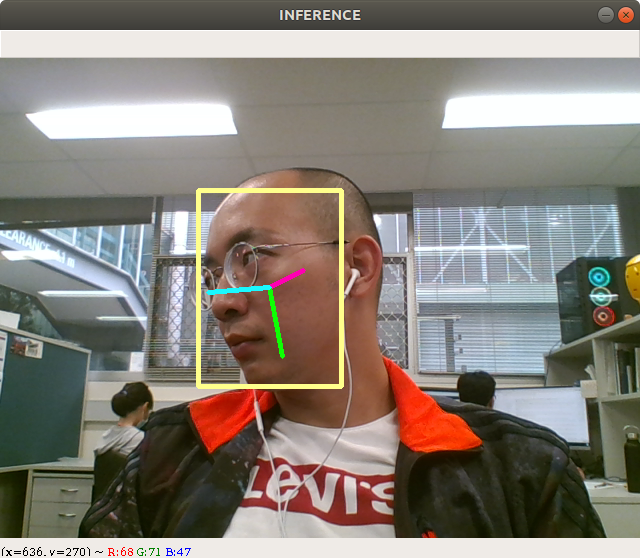

# Real-Time Head Pose Estimation
A PyTorch implementation of real-time head pose estimation. The original work can be found [here](https://github.com/natanielruiz/deep-head-pose). 

Download the pretrained model [here](https://drive.google.com/file/d/1kY2nfpnFsows14TLKTOd-8PYftOAeomh/view?usp=sharing).

<div align="center">
<br>
</div>

## Quickstart: Run Inference
```bash
python3 run_inference.py --pretrained [PRETRAINED_MODEL]
```
## Offline Testing
```bash
python3 test_on_video.py --pretrained [PRETRAINED_MODEL] --video [VIDEO] --output_string [NAME] --fps 30
```

## Requirements
* numpy
* pytorch
* torchvision 
* opencv2
* pillow
* [mtcnn](https://github.com/ipazc/mtcnn)
```bash
pip3 install mtcnn
```
